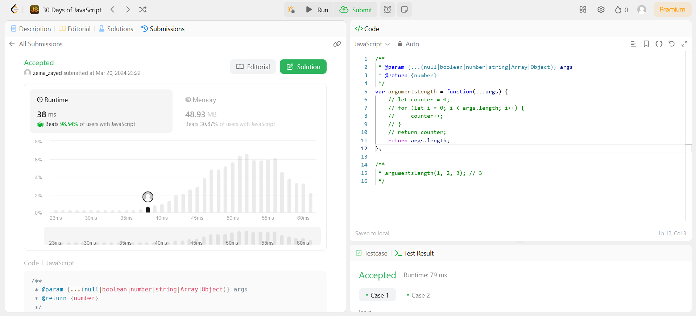

# 1- Create Hello World Function

# 2- Counter

# 3- To Be ot Not To Be

# 4- Counter II

# 5- Apply Transform Over Each Element in Array

# 6- Filter Elements From Array

# 7- Array Reduce Transformations

# 9- Return Length of Arguments Passed

